### Anna Harvey

# Midterm Project

## Question: Are stocks from the S&P 500 dependent on 10k sentiment? Do certain categorical words have more impact?

## What was done: 
First I ran the get_text_files_ZIPDURING that Professor Bowen supplied us with. It ended up with 494 companies from the S&P 500. It missed the other nine (total of 503) due to them not having an accessible 10k or there were companies who split their stock and they have the same 10k, so there was no need to download another version. Using the build_sample example from class, I continued the process until that was completed to the extent it could be. In order to create the right sample I created two new files to help organize the process. One was Get_returns and this supplied us with two columns in the sample that calculate the cumulative returns from [t to t+3] and [t+4 to t+10]. Then I used Get_SentimentScores to create 10 sentiment scores variables. The first two are scores that correlate to a machine learning approach used in the Journal of Financial Economics this year with BHR (one of the authors). One is a positive sentiment score and the other is negative. The next two scores are for the same idea, but using a dictionary that comes from two researchers named Loughran and McDonald. Then the last six variables are positive and negative scores for three categories: Industry Trends, Management and Leadership, and Risk Factors. These are all categories in a 10k that could negatively and/or positively affect stocks and their upwards or downwards turn.


## Findings: Continue along with the code to see all graphing, analytics, and final conclusion. We will be looking at:
- Boxplots
- Barcharts
- Scatterplots
- Violinplots
- HeatMaps
- Regressions
- Combos


```python
###########
# Imports #
###########
import pandas as pd
import statsmodels.api as sm
import matplotlib.pyplot as plt
from sklearn.linear_model import LinearRegression
import seaborn as sns
import numpy as np


```


```python
df = pd.read_csv('output/analysis_sample.csv', index_col = 0)
```


```python
## Here is the created sample
df.info()
```

    <class 'pandas.core.frame.DataFrame'>
    Int64Index: 494 entries, 0 to 493
    Data columns (total 18 columns):
     #   Column               Non-Null Count  Dtype  
    ---  ------               --------------  -----  
     0   Symbol               494 non-null    object 
     1   CIK                  494 non-null    int64  
     2   Accession_Num        494 non-null    object 
     3   URL                  494 non-null    object 
     4   Date_Released        494 non-null    object 
     5   Imm_change           494 non-null    float64
     6   OT_change            494 non-null    float64
     7   BHR_Negative         494 non-null    float64
     8   LM_Negative          494 non-null    float64
     9   BHR_Positive         494 non-null    float64
     10  LM_Positive          494 non-null    float64
     11  Industry_Trends_Pos  494 non-null    float64
     12  Industry_Trends_Neg  494 non-null    float64
     13  Management_Pos       494 non-null    float64
     14  Management_Neg       494 non-null    float64
     15  Risk_Factors_Pos     494 non-null    float64
     16  Risk_Factors_Neg     494 non-null    float64
     17  gsector              276 non-null    float64
    dtypes: float64(13), int64(1), object(4)
    memory usage: 73.3+ KB


```python
df.describe()
```


<div>
<style scoped>
    .dataframe tbody tr th:only-of-type {
        vertical-align: middle;
    }

    .dataframe tbody tr th {
        vertical-align: top;
    }

    .dataframe thead th {
        text-align: right;
    }
</style>
<table border="1" class="dataframe">
  <thead>
    <tr style="text-align: right;">
      <th></th>
      <th>CIK</th>
      <th>Imm_change</th>
      <th>OT_change</th>
      <th>BHR_Negative</th>
      <th>LM_Negative</th>
      <th>BHR_Positive</th>
      <th>LM_Positive</th>
      <th>Industry_Trends_Pos</th>
      <th>Industry_Trends_Neg</th>
      <th>Management_Pos</th>
      <th>Management_Neg</th>
      <th>Risk_Factors_Pos</th>
      <th>Risk_Factors_Neg</th>
      <th>gsector</th>
    </tr>
  </thead>
  <tbody>
    <tr>
      <th>count</th>
      <td>4.940000e+02</td>
      <td>494.000000</td>
      <td>494.000000</td>
      <td>494.000000</td>
      <td>494.000000</td>
      <td>494.000000</td>
      <td>494.000000</td>
      <td>494.000000</td>
      <td>494.000000</td>
      <td>494.000000</td>
      <td>494.000000</td>
      <td>494.000000</td>
      <td>494.000000</td>
      <td>276.000000</td>
    </tr>
    <tr>
      <th>mean</th>
      <td>7.890861e+05</td>
      <td>0.005649</td>
      <td>-0.037559</td>
      <td>0.025486</td>
      <td>0.015815</td>
      <td>0.023503</td>
      <td>0.004927</td>
      <td>0.006949</td>
      <td>0.009647</td>
      <td>0.006867</td>
      <td>0.005199</td>
      <td>0.011089</td>
      <td>0.014630</td>
      <td>34.510870</td>
    </tr>
    <tr>
      <th>std</th>
      <td>5.543153e+05</td>
      <td>0.029449</td>
      <td>0.298709</td>
      <td>0.003697</td>
      <td>0.003882</td>
      <td>0.004115</td>
      <td>0.001380</td>
      <td>0.003054</td>
      <td>0.002187</td>
      <td>0.001578</td>
      <td>0.001256</td>
      <td>0.002303</td>
      <td>0.002937</td>
      <td>13.032682</td>
    </tr>
    <tr>
      <th>min</th>
      <td>1.800000e+03</td>
      <td>-0.164666</td>
      <td>-0.738925</td>
      <td>0.008953</td>
      <td>0.002541</td>
      <td>0.003530</td>
      <td>0.000272</td>
      <td>0.001127</td>
      <td>0.003447</td>
      <td>0.001773</td>
      <td>0.001478</td>
      <td>0.004584</td>
      <td>0.006836</td>
      <td>10.000000</td>
    </tr>
    <tr>
      <th>25%</th>
      <td>9.727650e+04</td>
      <td>-0.006078</td>
      <td>-0.238194</td>
      <td>0.023559</td>
      <td>0.013218</td>
      <td>0.021520</td>
      <td>0.004006</td>
      <td>0.005133</td>
      <td>0.008144</td>
      <td>0.005812</td>
      <td>0.004399</td>
      <td>0.009658</td>
      <td>0.012892</td>
      <td>20.000000</td>
    </tr>
    <tr>
      <th>50%</th>
      <td>8.830380e+05</td>
      <td>0.010122</td>
      <td>-0.075163</td>
      <td>0.025719</td>
      <td>0.015555</td>
      <td>0.023873</td>
      <td>0.004836</td>
      <td>0.006421</td>
      <td>0.009413</td>
      <td>0.006784</td>
      <td>0.005038</td>
      <td>0.011028</td>
      <td>0.014702</td>
      <td>35.000000</td>
    </tr>
    <tr>
      <th>75%</th>
      <td>1.137554e+06</td>
      <td>0.023564</td>
      <td>0.124556</td>
      <td>0.027627</td>
      <td>0.017884</td>
      <td>0.025941</td>
      <td>0.005646</td>
      <td>0.008097</td>
      <td>0.011104</td>
      <td>0.007671</td>
      <td>0.005759</td>
      <td>0.012574</td>
      <td>0.016202</td>
      <td>45.000000</td>
    </tr>
    <tr>
      <th>max</th>
      <td>1.868275e+06</td>
      <td>0.090243</td>
      <td>1.178886</td>
      <td>0.038030</td>
      <td>0.035088</td>
      <td>0.037982</td>
      <td>0.010899</td>
      <td>0.026962</td>
      <td>0.016676</td>
      <td>0.016919</td>
      <td>0.015447</td>
      <td>0.022304</td>
      <td>0.028778</td>
      <td>60.000000</td>
    </tr>
  </tbody>
</table>
</div>


---

Simply from looking at the data one noticeable point is how different each sentiment score is in each theory and category. To see this more clearly, here are box plots that display the positive sentiment scores together and then the negative sentiment scores. 

---


```python
plt.figure(figsize=(10,10)) #makes sure the x axis labels don't run into each other

# Boxplots for positive sentiment scores
sns.boxplot(data=df[['BHR_Positive', 'LM_Positive', 'Industry_Trends_Pos', 'Management_Pos', 'Risk_Factors_Pos']])
plt.title('Distribution of Positive Sentiment Scores')
plt.ylabel('Sentiment Score')
plt.show()

plt.figure(figsize=(10,10)) #makes sure the x axis labels don't run into each other

# Boxplots for negative sentiment scores
sns.boxplot(data=df[['BHR_Negative', 'LM_Negative', 'Industry_Trends_Neg', 'Management_Neg', 'Risk_Factors_Neg']])
plt.title('Distribution of Negative Sentiment Scores')
plt.ylabel('Sentiment Score')
plt.show()

```


    
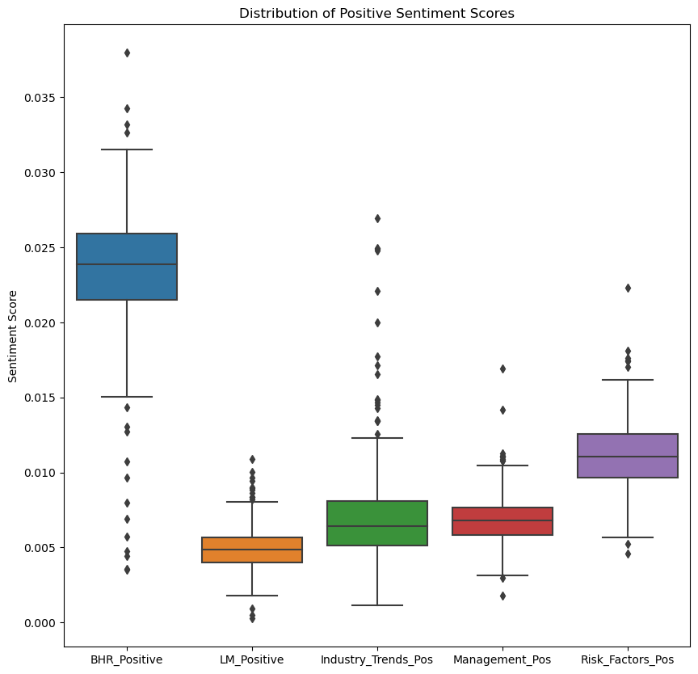
    


    
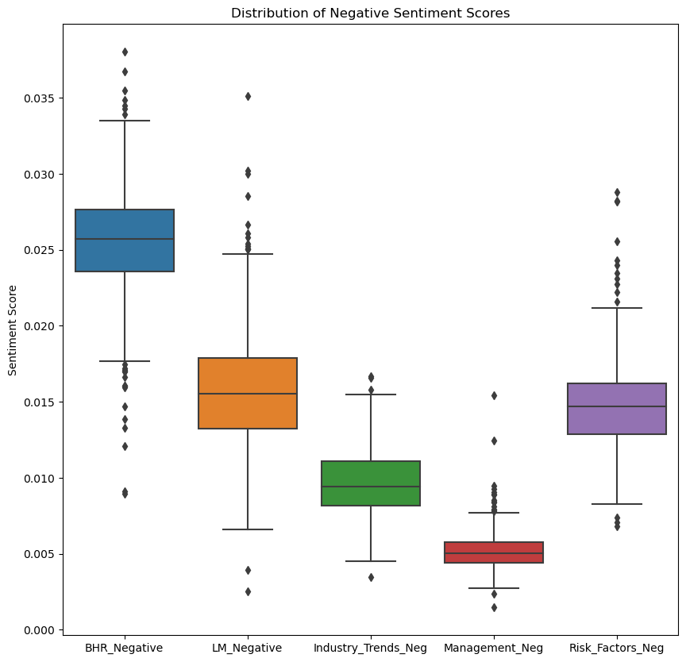
    


---
Takeaways: 
- BHR is the highest in sentiment scores for both negative and positive. This may hint that a machine learning approach (it was used in the Journal of Financial Economics this year) would be more effective in trying to find the right amount of sentiment for positive and negative views. 
- LM, the dictionary from two researchers named Loughran and McDonald, is high in the negative category and low in the positive. 
- The categories are close in both negative and positive, except for the outliers: Industry_Trends_Pos and Risk_Factors_Neg have more noticeable ones. 

---

To see the sentiment scores in a different light, here are the averages for each category: 


```python
# Average sentiment scores for positive and negative groups
pos_avg = df[['BHR_Positive', 'LM_Positive', 'Industry_Trends_Pos', 'Management_Pos', 'Risk_Factors_Pos']].mean()
neg_avg = df[['BHR_Negative', 'LM_Negative', 'Industry_Trends_Neg', 'Management_Neg', 'Risk_Factors_Neg']].mean()

# Grouped bar chart
labels = ['BHR', 'LM', 'Industry_Trends', 'Management', 'Risk_Factors']
x = np.arange(len(labels))
width = 0.35
fig, ax = plt.subplots()
rects1 = ax.bar(x - width/2, pos_avg, width, label='Positive')
rects2 = ax.bar(x + width/2, neg_avg, width, label='Negative')
ax.set_xticks(x)
ax.set_xticklabels(labels)
ax.set_ylabel('Sentiment Score')
ax.set_title('Average Sentiment Scores by Group')
ax.legend()
plt.show()

```


    
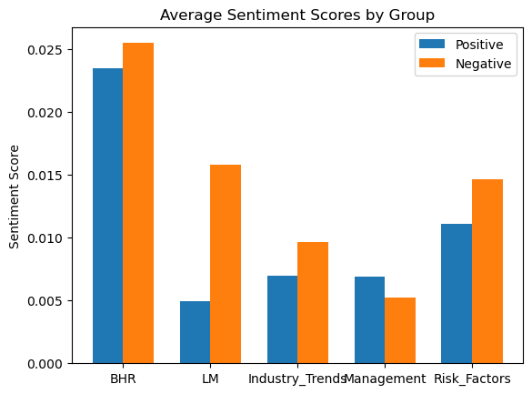
    


---
Takeaways: 
- As said before, BHR is the highest out of all theories/categories. 
- LM tracks higher negative sentiment. 
- For industry trends and risk factors, this makes since they will explain both in a more negative light, unless they are a company that is at the top of their competitive market. 
- Management was interesting, on average there is a more positive sentiment than negative. 


Next I am goint to create a bar graph that shows the sentiment score average for each category for each sector. This first graph is positive reflection and the second is negative reflection. 

---


```python
sector_sentiment = df.groupby('gsector')[['Industry_Trends_Pos', 'Management_Pos', 'Risk_Factors_Pos']].mean()

sector_sentiment.plot(kind='bar', figsize=(10, 6))
plt.title('Mean Positive Sentiment Scores by Industry Sector')
plt.ylabel('Mean Sentiment Score')
plt.show()

sector_sentiment = df.groupby('gsector')[['Industry_Trends_Neg', 'Management_Neg', 'Risk_Factors_Neg']].mean()

sector_sentiment.plot(kind='bar', figsize=(10, 6))
plt.title('Mean Negative Sentiment Scores by Industry Sector')
plt.ylabel('Mean Sentiment Score')
plt.show()

```


    
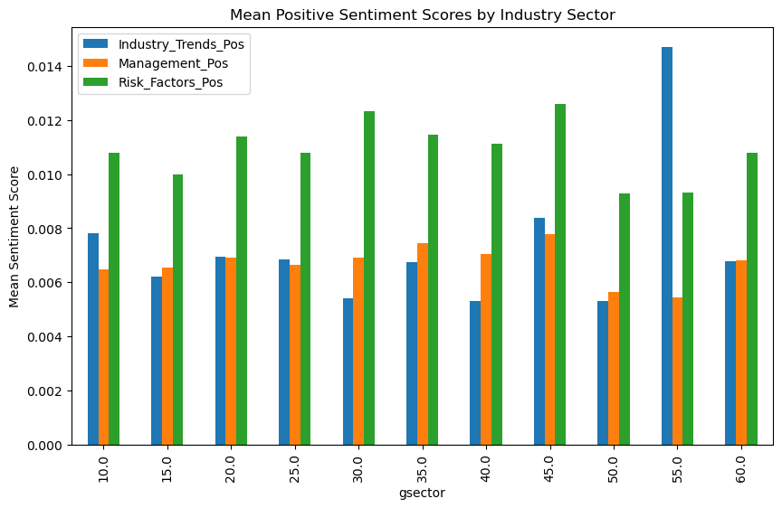
    


    
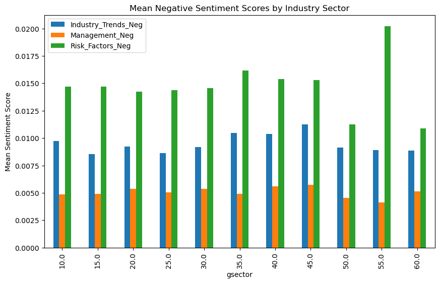
    


---

In the positive section, the only one that is the most noticeable is the gsector: 55, Utilities. In negative it is again, the most noticeable with the highest negative risk factors sentiment score. 

The lowest scores for both positive and negative scores goes to gsector 50, Communications. 

Not much more to take away from here since they are all mostly the same. 


Now we are going to dig into the cumulative stock returns. Again, Imm_change and OT_change calculate the cumulative returns from [t to t+3] and [t+4 to t+10] respectively. This next code creates two columns of graphs, the one on the left is immediate and the right is overtime. Each row is a different sentiment variable. 

---


```python
# Is there ANY affect of the sentiment score on stocks?

sentiment_vars = ['BHR_Negative', 'BHR_Positive', 'LM_Negative', 'LM_Positive', 'Industry_Trends_Pos', 'Industry_Trends_Neg', 'Management_Pos', 'Management_Neg', 'Risk_Factors_Pos', 'Risk_Factors_Neg']

fig, axs = plt.subplots(ncols=2, nrows=len(sentiment_vars), figsize=(10, 50))

ymin = df[['Imm_change', 'OT_change']].min().min()
ymax = df[['Imm_change', 'OT_change']].max().max()
xmin = df[sentiment_vars].min().min()
xmax = df[sentiment_vars].max().max()

for i, var in enumerate(sentiment_vars):
    ax1 = sns.scatterplot(data=df, x=var, y="Imm_change", hue="Symbol", legend=False, ax=axs[i][0])
    ax1.set_ylim(ymin, ymax)
    ax1.set_xlim(xmin, xmax)
    ax2 = sns.scatterplot(data=df, x=var, y="OT_change", hue="Symbol", legend=False, ax=axs[i][1])
    ax2.set_ylim(ymin, ymax)
    ax2.set_xlim(xmin, xmax)

plt.tight_layout()
plt.show()

```


    
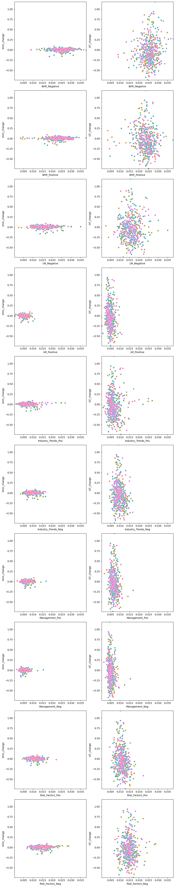
    


---

We can confidently say that there is most cetainly an affect (of some sort). It is not known yet if the negative sentiment scores lead to a dip in stock nor if the positive sentiment scores lead to a rise. 

Next is a supporting violin graph that displays the true fact, again, that there is definitely an affect from the 10ks - shows the change in stock price for immediate(t to t+2) and the Overtime change (t+3 to rest). 

---


```python
df_violin = df[['Imm_change', 'OT_change']]

sns.set(style="whitegrid")

sns.violinplot(data=df_violin, split=True, inner="quart")
plt.show()

```


    
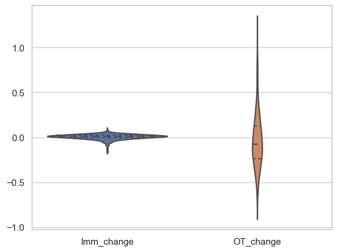
    


---

To attempt a deep dive, I am going to use a heatmap. This is a great way to display the correlation between variables, and in our case, how all the positive and negative sentiment scores correlate to the stock prices with their day segment fluctuations.

---


```python
plt.figure(figsize=(10,4))
sentiment_cols = ['BHR_Negative', 'LM_Negative', 'BHR_Positive', 'LM_Positive', 'Industry_Trends_Pos', 'Industry_Trends_Neg', 'Management_Pos', 'Management_Neg', 'Risk_Factors_Pos', 'Risk_Factors_Neg']
returns_cols = ['Imm_change', 'OT_change']

corr_matrix = df[sentiment_cols + returns_cols].corr()

sns.heatmap(corr_matrix, cmap="RdYlGn", annot=True)
plt.title("Correlation Matrix")
plt.show()
```


    
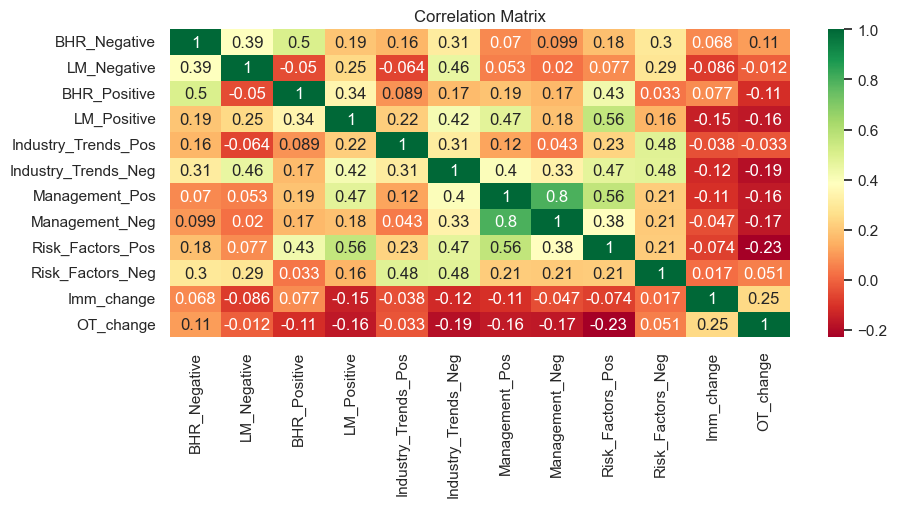
    


---
To display this a little more simply here is another heat map simplified:


```python
plt.figure(figsize=(8,2))

correlations = corr_matrix[["BHR_Positive", "BHR_Negative", "LM_Positive", "LM_Negative", 
               'Industry_Trends_Pos', 'Industry_Trends_Neg', 'Management_Pos', 'Management_Neg', 'Risk_Factors_Pos',
                'Risk_Factors_Neg']].drop(["BHR_Positive", "BHR_Negative", "LM_Positive", "LM_Negative", 
               'Industry_Trends_Pos', 'Industry_Trends_Neg', 'Management_Pos', 'Management_Neg', 'Risk_Factors_Pos',
                'Risk_Factors_Neg'])

sns.heatmap(correlations, cmap="RdYlGn", annot=True)
plt.title("Correlation Matrix")
plt.show()
```


    
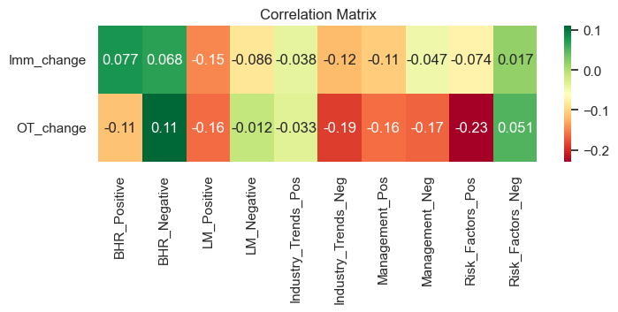
    


---
Takeaways: 
- Interesting how there is a positive correlation, on average, for both BHR positive and negative. 
- LM Positive does not seem to be correlating in the right direction as it should be- its negative scores create a higher overtime change
- Industry Trends correlations display that their could possibly be an affect, especially if it is talked about negatively in the 10k
- Management on the other hand is the same in both positive and negative
- Risk factors is the exact opposite of what we would expect. This might mean that people see positive on risk factors as a lie and tend to think that whatever company they are looking at is not saying everything. On the other hand if the risk is more negative people may think they are being more truthful about their company so they buy. They may also buy since they think it is at a low. This creates more buy orders and increases the stock. This is especially applicable for all companies in the S&P 500 since they are the best representation of the market. THIS IS ALL SPECULATION, but it might be interesting to do a deeper dive in this category to see why it is on the flip side for negative and positive. 


To look at the correlation in a different light, here is another tool: regression. I know we just learned this, but it is in the tool box now so I am going to use it. 
We are going to create a simple regression with the sentiment_cols and return_cols that we created above. 

---


```python
X = df[sentiment_cols]
y = df[returns_cols]

model = LinearRegression().fit(X, y)

print('R-squared:', model.score(X, y))
print('Coefficients:', model.coef_)
```

    R-squared: 0.09876416449038733
    Coefficients: [[  0.58538401  -0.51564811   0.73936015  -2.6253478   -0.55020953
       -1.32562815  -1.1720823    0.26013751   0.1089022    1.15448389]
     [ 22.368614    -5.56396538 -11.039647    -9.23599104  -5.49837114
      -26.0176994   27.47036066 -46.40973468 -16.10626123  15.88233366]]


---

sentiment_cols = ['BHR_Negative', 'LM_Negative', 'BHR_Positive', 'LM_Positive', 'Industry_Trends_Pos', 
'Industry_Trends_Neg', 'Management_Pos', 'Management_Neg', 'Risk_Factors_Pos', 'Risk_Factors_Neg']

returns_cols = ['Imm_change', 'OT_change']

Here is the lists to just see it one more time as we analyze. 

First noticeable takeaway: R-squared = 0.0987. 

This means this equation does not fit the model well at all. 

Next. 


To try and see if there is a closer correlation with any of them, I am going to create a subplot for each of our positive and negative sentiment variables. It creates a scatterplot for each compared to OT_change, and then adds a regression line on top to see if there is any fit. Overall, this next plot is attempting to see if one or two variables have more affect on the stocks than others. 

---


```python
X = df[['BHR_Positive', 'LM_Positive', 'Industry_Trends_Pos', 'Management_Pos', 'Risk_Factors_Pos', 'BHR_Negative', 'LM_Negative', 'Industry_Trends_Neg', 'Management_Neg', 'Risk_Factors_Neg']]
y = df['OT_change']

model = sm.OLS(y, sm.add_constant(X)).fit()

fig, axs = plt.subplots(2, 5, figsize=(16, 6), sharey=True)
for i, ax in enumerate(axs.flat):
    if i < len(X.columns):
        ax.scatter(X[X.columns[i]], y, alpha=0.5)
        ax.plot(X[X.columns[i]], model.predict(), color='r')
        ax.set_xlabel(X.columns[i])
    else:
        ax.axis('off')
plt.tight_layout()
plt.show()

```


    
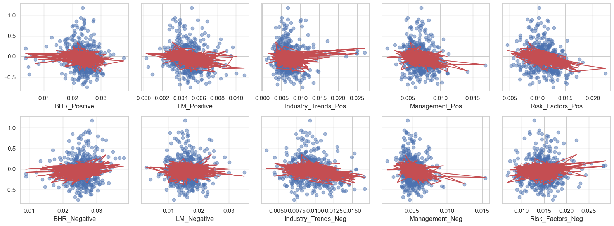
    


---
Welp. They all pretty much look the same. 
Therefore, the variables we created for the sentiment scores do not individually affect the market and their cumulative returns overtime. 
 
Lastly, we are going to graph the overall sentiment score of each symbol and compare that with their OT_change. The red is for negative overall sentiment score and green for positive overall sentiment score.  
---


```python
df['Positive_Sentiment'] = df[['BHR_Positive', 'LM_Positive', 'Industry_Trends_Pos', 'Management_Pos', 'Risk_Factors_Pos']].mean(axis=1)
df['Negative_Sentiment'] = df[['BHR_Negative', 'LM_Negative', 'Industry_Trends_Neg', 'Management_Neg', 'Risk_Factors_Neg']].mean(axis=1)
df['Overall_Sentiment'] = df['Positive_Sentiment'] - df['Negative_Sentiment']

fig, ax = plt.subplots(figsize=(10, 6))
ax.scatter(df['Overall_Sentiment'], df['OT_change'], c=df['Positive_Sentiment'] >= df['Negative_Sentiment'], cmap='RdYlGn')
ax.set_xlabel('Overall_Sentiment')
ax.set_ylabel('OT_change')
ax.set_title('Overall Sentiment vs. OT_change')
plt.show()

```


    
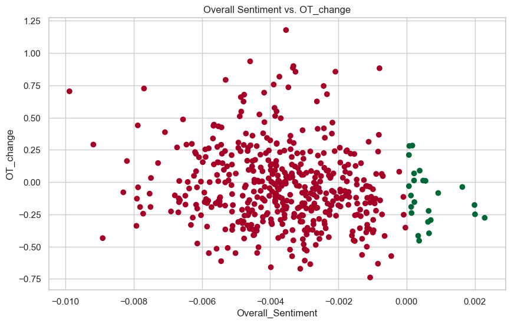
    


---
This does not display any new insights besides the fact that there are no outliers or crazy moves for the positive sentiment scores - they stay within the 0.25 and -0.25 cumulative returns. On the other side, they are between 1 and -0.75. Therefore, there is a lot more fluctuation of a stock when it has a negative overall sentiment score and more steadiness when there is a positive overall sentiment score. 

This study is a great example of how hard the market is to predict. Many people think differently, whether that be intelligently or not, and there are also plenty of other factors (interest rates, political and economic events, supply and demand, market's momentum, etc.) that we are not looking at in this analysis that may put a company's stock up or down. 

Final conclusion: 
---
We need to do more research and look at better variables to see if there is ever a correlation between 10k's and sentiment scores. We know that there is most certainly an affect, but it is not completely clear how besides the fact that there is a lot more fluctuation of a stock when it has a negative overall sentiment score and more steadiness when there is a positive overall sentiment score. 
---
